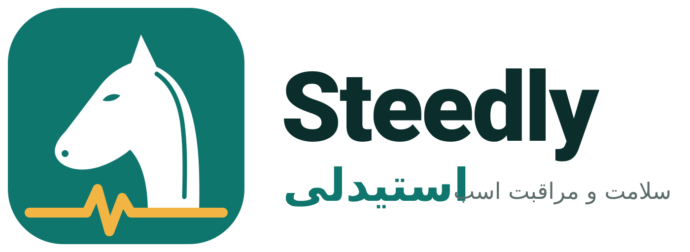

# **سند نیازمندی‌های نرم‌افزاری (SRS) و طرح توسعه نرم‌افزار (SDP)  
برای استیدلی (Steedly) — پلتفرم سلامت و مراقبت اسب**

> راهنمای هویت بصری و رنگ‌های سازمانی: [`brand/BRAND.md`](brand/BRAND.md)

---

## **1. سند نیازمندی‌های نرم‌افزاری (SRS)**

### **1.1. مقدمه**
این سند نیازمندی‌های سیستم جامع اطلاعات، خدمات و فروشگاه آنلاین مرتبط با اسب را تشریح می‌کند. سیستم شامل دو بخش اصلی است:
- **PWA برای iOS و وب**
- **اپلیکیشن اختصاصی اندروید**

### **1.2. اهداف کلی پروژه**
- ایجاد مرجع جامع اطلاعاتی درباره‌ی انواع اسب‌ها در قالب بلاگ
- ارائه خدمات اعزام دامپزشک و اسب‌کش
- فروشگاه آنلاین متعلقات، داروها و مکمل‌های اسب
- اطلاع‌رسانی مسابقات داخلی و بین‌المللی اسب

### **1.3. شرح نیازمندی‌های عملیاتی**

#### **1.3.1. ماژول بلاگ**
- امکان نمایش مقالات با تیتر، عکس مناسب و محتوای ساخت‌یافته
- دسته‌بندی بر اساس نژاد، کاربرد، جغرافیا و ...
- سیستم جستجوی پیشرفته در مقالات
- امکان ذخیره مقالات برای مطالعه آفلاین (PWA)
- نمایش محتوای چندرسانه‌ای (تصویر، ویدیو، گالری)

#### **1.3.2. ماژول خدمات اعزام**
- فرم ثبت مشخصات دامپزشک (نام، تخصص، منطقه، تماس، رزومه، تصویر)
- فرم ثبت مشخصات اسب‌کش (اطلاعات حمل، تجهیزات، منطقه فعالیت)
- سیستم رزرو آنلاین خدمات
- پیگیری وضعیت درخواست خدمات
- سیستم امتیازدهی و نظر برای سرویس‌دهندگان

#### **1.3.3. ماژول فروشگاه**
- نمایش محصولات (تجهیزات، داروها، مکمل‌ها)
- دسته‌بندی محصولات
- سبد خرید و پرداخت آنلاین
- پیگیری سفارشات
- مدیریت موجودی

#### **1.3.4. ماژول مسابقات**
- تقویم مسابقات داخلی و خارجی
- فیلتر بر اساس نوع مسابقه (کورس، پرش، درساژ، ...)
- اعلان‌های یادآوری مسابقات
- اطلاعات کامل مسابقات (مکان، زمان، جوایز، شرایط شرکت)
- نتایج مسابقات گذشته

### **1.4. نیازمندی‌های غیرعملیاتی**
- طراحی واکنش‌گرا و سازگار با موبایل و دسکتاپ
- زمان بارگذاری صفحه کمتر از 3 ثانیه
- پشتیبانی آفلاین برای PWA
- امنیت داده‌های کاربری
- سازگاری با مرورگرهای مدرن و اندروید 8 به بالا

### **1.5. نیازمندی‌های فنی پلتفرم**

#### **1.5.1. PWA (iOS و وب)**
- Technology Stack: React.js / Next.js + TypeScript
- Service Worker برای عملکرد آفلاین
- Web App Manifest
- قابلیت نصب روی صفحه اصلی دستگاه‌های iOS و دسکتاپ
- Push Notifications

#### **1.5.2. اپلیکیشن اندروید**
- Technology Stack: Kotlin + Jetpack Compose
- معماری MVVM
- پشتیبانی از آفلاین
- استفاده از سیستم‌های نوتیفیکیشن اندروید
- انتشار در Google Play Store

#### **1.5.3. بک‌اند و API**
- Framework: Node.js + Express یا Django
- دیتابیس: PostgreSQL + Redis برای کش
- RESTful API یا GraphQL
- ذخیره‌سازی فایل: AWS S3 یا مشابه ایرانی
- سرور: لینوکس

---

## **2. طرح توسعه نرم‌افزار (SDP)**

### **2.1. مراحل توسعه**

#### **فاز 1: تحقیق و طراحی (4 هفته)**
- تحقیق کامل در مورد محتوای اسب (نژادها، بیماری‌ها، تجهیزات)
- طراحی UX/UI
- ایجاد طرح پایگاه داده
- تعریف API Endpoints
- انتخاب تکنولوژی‌ها

#### **فاز 2: توسعه بک‌اند (6 هفته)**
- راه‌اندازی سرور و دیتابیس
- توسعه ماژول کاربران و احراز هویت
- توسعه ماژول بلاگ (CRUD مقالات)
- توسعه ماژول خدمات
- توسعه ماژول فروشگاه
- توسعه ماژول مسابقات

#### **فاز 3: توسعه فرانت‌اند PWA (8 هفته)**
- ساخت کامپوننت‌های پایه
- پیاده‌سازی صفحه بلاگ
- پیاده‌سازی صفحات خدمات
- پیاده‌سازی فروشگاه
- پیاده‌سازی تقویم مسابقات
- افزودن قابلیت‌های PWA

#### **فاز 4: توسعه اپلیکیشن اندروید (6 هفته)**
- ایجاد پروژه اندروید
- پیاده‌سازی رابط کاربری
- اتصال به API بک‌اند
- تست و دیباگ

#### **فاز 5: تست و استقرار (4 هفته)**
- تست یکپارچگی
- تست عملکرد
- تست امنیت
- انتشار نسخه اولیه
- جمع‌آوری بازخورد

### **2.2. ساختار تیم توسعه**
- مدیر پروژه: 1 نفر
- طراح UX/UI: 1 نفر
- توسعه‌دهنده بک‌اند: 2 نفر
- توسعه‌دهنده فرانت‌اند PWA: 2 نفر
- توسعه‌دهنده اندروید: 2 نفر
- متخصص محتوا (اسب): 1 نفر
- تست‌کننده: 1 نفر

### **2.3. زمان‌بندی کلی پروژه**
- کل زمان پروژه: **28 هفته** (~7 ماه)
- شروع: ماه اول
- تحویل نسخه MVP: پایان ماه 5
- تحویل نهایی: پایان ماه 7

### **2.4. بودجه تخمینی**
| بخش | هزینه تخمینی |
|------|--------------|
| طراحی و تحقیق | 40 میلیون تومان |
| توسعه بک‌اند | 120 میلیون تومان |
| توسعه PWA | 160 میلیون تومان |
| توسعه اندروید | 120 میلیون تومان |
| تولید محتوا | 60 میلیون تومان |
| تست و استقرار | 40 میلیون تومان |
| **مجموع** | **540 میلیون تومان** |

### **2.5. ریسک‌ها و راهکارها**
| ریسک | احتمال | تأثیر | راهکار کاهش |
|------|---------|--------|--------------|
| کمبود متخصص محتوای اسب | متوسط | زیاد | همکاری با انجمن‌های مرتبط |
| مشکل در پرداخت آنلاین | کم | متوسط | استفاده از درگاه‌های معتبر |
| عدم استقبال کاربران | متوسط | زیاد | بازاریابی هدفمند |
| حجم بالای محتوا | زیاد | متوسط | اولویت‌بندی در تولید محتوا |

### **2.6. معیارهای موفقیت**
- جذب 5000 کاربر فعال در ماه اول
- انتشار 200 مقاله تخصصی در 6 ماه اول
- ثبت 100 سفارش خدمات در ماه
- فروش 50 میلیون تومان در ماه اول فروشگاه
- امتیاز 4+ در استورها

---

## **3. جدول محتوای نمونه بلاگ**

### **دسته‌بندی‌های اصلی مقالات:**
1. **نژادهای اسب**
   - اسب عربی
   - ترکمن
   - انگلیسی
   - فریزین
   - ...

2. **بیماری‌ها و سلامت**
   - بیماری‌های گوارشی
   - مشکلات سم
   - مراقبت‌های دندانی
   - واکسیناسیون

3. **تجهیزات و لوازم**
   - زین و یراق
   - مکمل‌های غذایی
   - وسایل مراقبت

4. **ورزش‌های سوارکاری**
   - درساژ
   - پرش با اسب
   - چوگان
   - کورس

5. **تاریخ و فرهنگ**
   - اسب در تاریخ ایران
   - اسب در ادبیات
   - موزه‌های اسب در جهان

---

**تهیه و تنظیم:**  
تیم توسعه پلتفرم جامع اسب  
تاریخ: ۱۴۰۳/۰۱/۱۵  

*این سند به صورت دوره‌ای بروزرسانی خواهد شد.*
